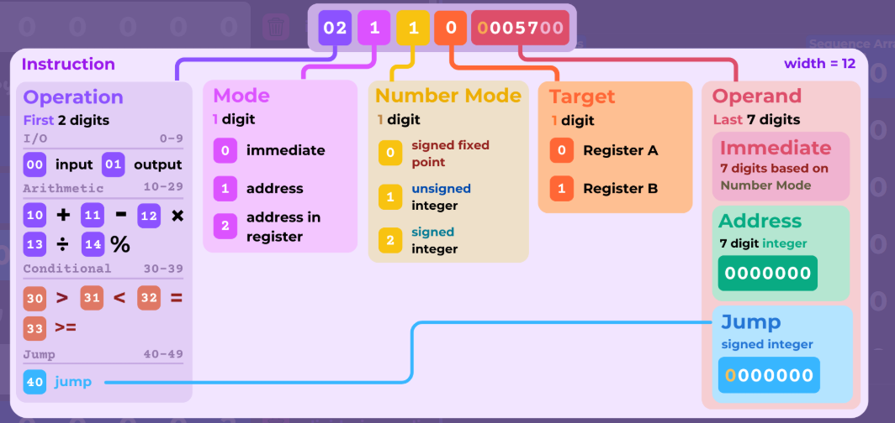

# Overview
The course The Simple Joy of Programming is a series of videos taught by Nic Barker that starts from the very base of what a computer is and does, and builds on top of itself for how instructions are executed and run. 
Since the course itself does not provide any homework assignments, I took it upon myself to practice the concepts by making a working simulation of the custom instruction set that was slowly being built over
the course of the first seven videos. 

# Current phase as of 1/7/2026:
The proof of concept is working, although the simulation cannot do any calculations yet; input, conversion, and output are working for a very basic instruction set compiler and disassembler as provided by Episode 3.
The next step is to upgrade the proof of concept and refactor to the final Episode 7.

# Goals
1. To be able to write characters to the computer as Input and have something happen
  1a. Because of complexity, the simulation is only a complex programmable calculator
2. To be able to write the instruction set format and have the same things happen as if the valid characters were written to the input
3. To have the output be expected for what was given to the computer
4. To follow the instruction set given in the Course to the T and have an understanding of the computer through a high-level, programmable simulation

## Stretch:
1. Make a visual GUI instead of using the CLI for the code
2. Port to Python for Python practice

# Other information:
The instruction set that I am following can be found and referenced below

